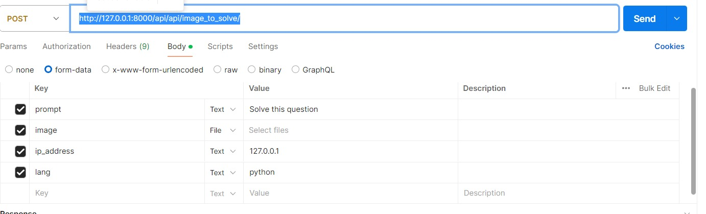
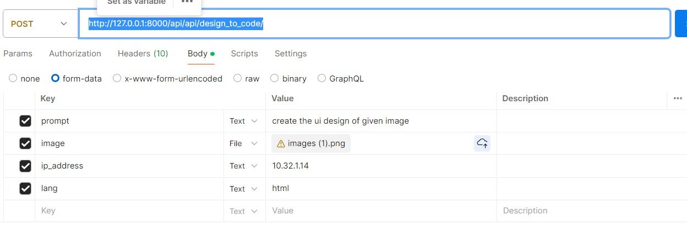

# CodeAI

## Code to bugs

URL: http://127.0.0.1:8000/api/api/detect_bugs/

Input fields: 
{
    "code": "def factorial(n):\n    if n == 0:\n        return 1\n    else:\n        return n * factorial(n-1)",
    "ip_address": "10.32.1.14"
}

## code explainer: 

URL: http://127.0.0.1:8000/api/api/code_explainer/

Input: 
{
  "code": "def factorial(n):\n    if n == 0:\n        return 1\n    else:\n        return n * factorial(n-1)",
  "ip_address":  "10.32.1.14"

}

Solve with doc: 

URL: http://127.0.0.1:8000/api/api/solve_with_doc/ 

input fields:

## Image to solve

URL: http://127.0.0.1:8000/api/api/image_to_solve/

code converter: 

URL: http://127.0.0.1:8000/api/api/convert_code/

Input fields: 

{
    "prompt": "int add(int a, int b) {\n    return a + b;\n}",
    "lang": "javascript",
    "ip_address":  "10.32.1.14"
}

## Prompt to code: 

URL: http://127.0.0.1:8000/api/api/prompt_to_code/

Input: {
    "prompt": "Write a sorting code.",
    "lang": "python"
}

Design to code: 

URL: http://127.0.0.1:8000/api/api/design_to_code/
