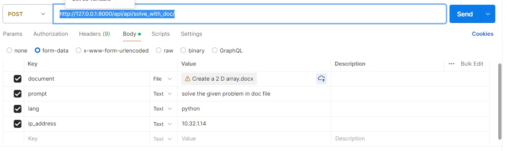

# CodeAI

## Code to bugs

(./directory_1/directory_2/.../directory_n/plot.png)

URL: http://127.0.0.1:8000/api/api/detect_bugs/

Input fields: 
{
    "code": "def factorial(n):\n    if n == 0:\n        return 1\n    else:\n        return n * factorial(n-1)",
    "ip_address": "10.32.1.14"
}
